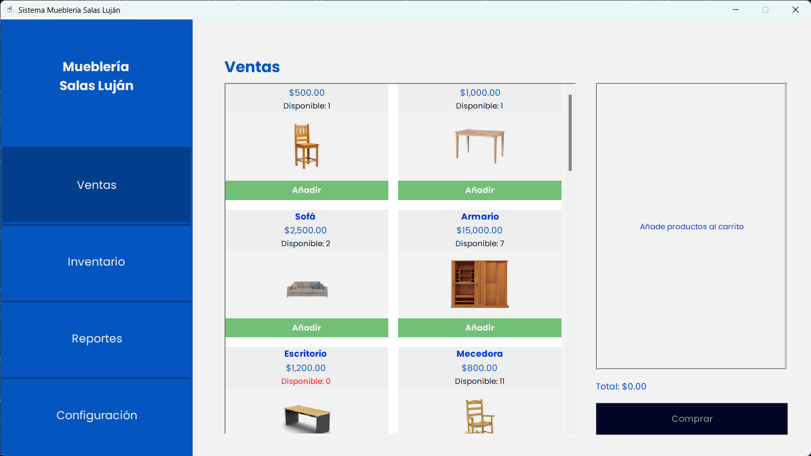
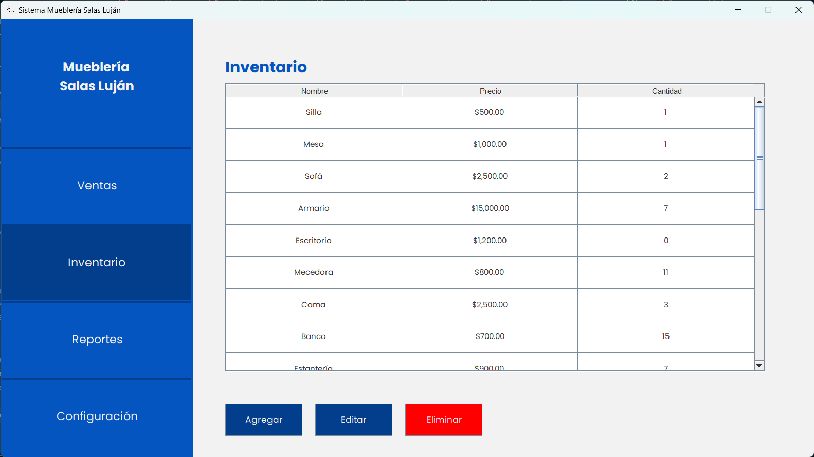

# Mueblería Salas Luján

Este es un proyecto de software para una mueblería llamada "Salas Luján". El sistema permite gestionar el inventario de muebles, realizar ventas, generar reportes y más.

## Funcionalidades

- **Inventario:** Administra y realiza un seguimiento del inventario de muebles, incluyendo detalles como nombre, precio, cantidad y enlaces de imágenes.

- **Ventas:** Registra las ventas realizadas, incluyendo información sobre el vendedor, el cliente, los productos vendidos y el total de la venta.

- **Reportes:** Genera informes y estadísticas sobre las ventas y el inventario de la mueblería.

- **Configuración:** Personaliza la configuración del sistema según las necesidades de tu negocio.

## Capturas de Pantalla





## Requisitos del Sistema

- Java 8 o superior
- Maven (opcional, para compilar el proyecto)
- Una base de datos compatible con JDBC (por ejemplo, MySQL, PostgreSQL)

## Instalación

1. Clona este repositorio a tu máquina local:

   ```shell
   git clone https://github.com/tuusuario/muebleria-salas-lujan.git
   ```

2. Importa el proyecto en tu IDE Java favorito
3. Ejecuta la aplicación.

## Uso

Inicia sesión, usando el nombre de usuario y la contraseña predeterminados:
admin / admin

## Contribuir

Si deseas contribuir a este proyecto, sigue estos pasos:

1. Haz un fork del repositorio.
2. Crea una rama para tu función: git checkout -b mi-funcion
3. Realiza tus cambios y realiza un commit: git commit -m "Añade una nueva característica"
4. Haz push a tu rama: git push origin mi-funcion
5. Abre una pull request en GitHub.

Hecho con ❤️ por Emilio Salas
